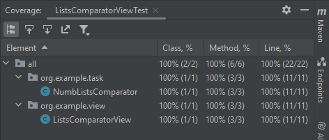
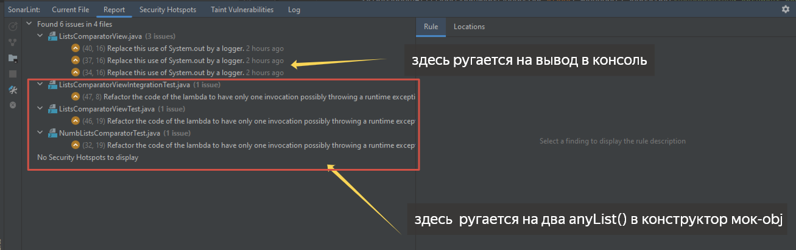

## Тимофеев Вадим

### Группа: Веб-разработка на Java | Тех. специализация | 2

> `Unit-тесты. Урок 6. Юнит тестирование в других языках`

* **Тестирование класса NumbListsComparator** - покрыты сценарии прихода в качестве аргумента пустого списка с
  выбрасыванием
  исключения, проверена корректность сравнения списков по среднему значению, в том числе равных и возвращаемое значение.

* **Тестирование класса ListsComparatorView** - проверена корректность вывода в консоль сообщений c мокированием
  NumbListsComparator (Unit-тесты), а также с использованием реального объекта
  (Интеграционные тесты)

`Отчет о покрытии тестами:`  

`Отчет SonarLint:`   
